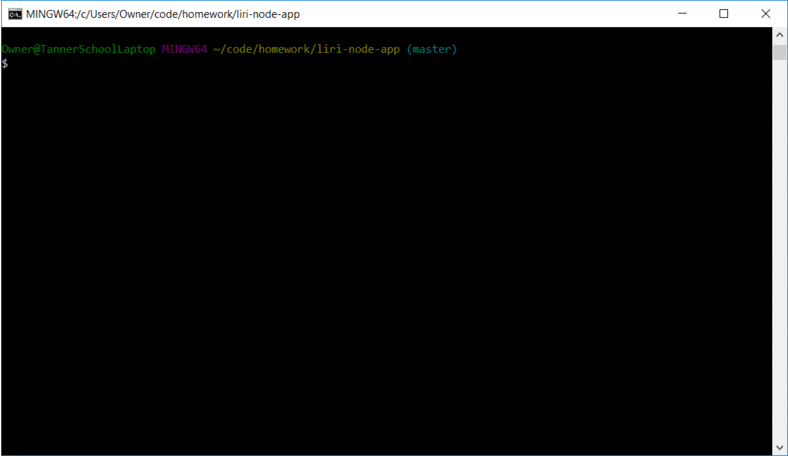
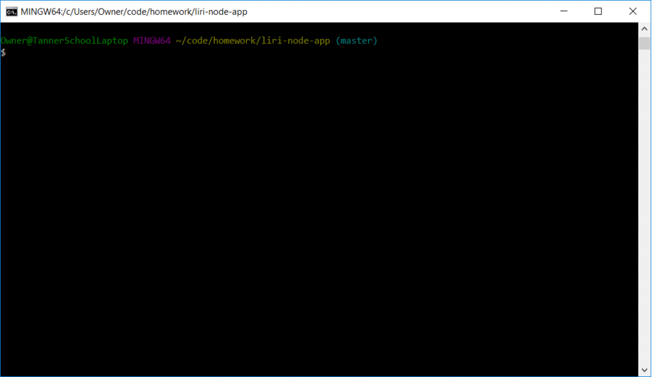
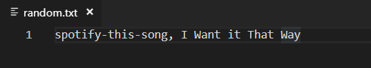

# API Node app

This app allows users to input the below commands into the termanial and get a proper responce back based on the command given:

   * `concert-this`

   * `movie-this`

   * `spotify-this-song`

   * `do-what-it-says`

   All the commands that are executed will be log to a log.txt file along with the info that was returned from the query.
# Examples

# concert-this
This command queries the bands in town api for concert dates and locations for the artist that you input.

 

If there is no artist input the program will tell you that you did not provide an artist.

 

# movie-this
This command queries the omdb api for information about the movie the user input such as Title, release year, IMDB rating, Rotten Tomatos Rating, Country produced in, Language, plot and actors.

 

If there is no movie input the function with auto look up the movie Mr. Nobody

 

# spotify-this-song
This command queries the spotify api for information about the song the user input such as song name, Artist, Album song is on and a link to preview the song. 

If no song was provided the fucntion will auto look up "the sign" by ace of base.

# do-what-it-says
This command reads the random.text file contents and executes the command found with the info associated with the command.

Below are the contents of the Random.txt file.

# No command given
If there is no command given you will be given a message saying "no command was given".

